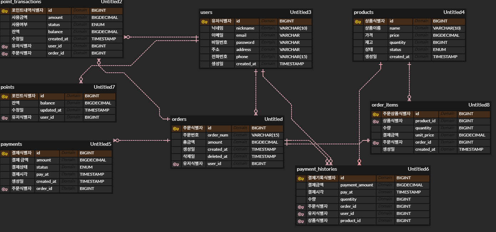

#  커피숍 주문 시스템

다수 서버 환경에서도 안정적으로 동작하는 커피숍 주문 시스템입니다.

---

## 목차

1. [설계 내용 (ERD, API 명세서)](#1-설계-내용)
2. [설계의 의도](#2-설계의-의도)
3. [문제해결 전략 및 분석](#3-문제해결-전략-및-분석)
4. [기술적 선택 이유](#4-기술적-선택-이유)

---

## 1. 설계 내용

### ERD




### API 명세서

#### 1) 커피 메뉴 목록 조회

| 항목 | 내용 |
|------|------|
| Method | `GET` |
| URL | `/api/products` |
| 설명 | 전체 커피 메뉴 목록을 조회합니다. |

**Response (200 OK)**
```json
{
  "success": true,
  "code": "200 OK",
  "message": "상품 목록 조회 성공",
  "data": [
    {
      "id": 1,
      "name": "아메리카노",
      "price": 4500.00,
      "status": "ON_SALE",
      "createdAt": "2026-04-06T10:29:00.066213"
    },
    {
      "id": 2,
      "name": "카페라떼",
      "price": 5000.00,
      "status": "ON_SALE",
      "createdAt": "2026-04-06T10:29:00.112856"
    }
  ],
  "timestamp": "2026-04-06T10:29:05.6548038"
}
```

#### 2) 포인트 충전

| 항목 | 내용 |
|------|------|
| Method | `POST` |
| URL | `/api/points/charge` |
| 설명 | 사용자의 포인트를 충전합니다. |

**Request Body**
```json
{
  "userId": 1,
  "amount": 50000
}
```

**Response (200 OK)**
```json
{
  "success": true,
  "code": "200 OK",
  "message": "포인트 충전 성공",
  "data": {
    "userId": 1,
    "chargedAmount": 1000000,
    "balance": 1000000.00,
    "updatedAt": "2026-04-06T10:29:00.147101"
  },
  "timestamp": "2026-04-06T10:29:22.7900631"
}
```

#### 3) 커피 주문/결제

| 항목 | 내용 |
|------|------|
| Method | `POST` |
| URL | `/api/orders` |
| 설명 | 커피를 주문하고 포인트로 결제합니다. |

**Request Body**
```json
{
  "userId": 1,
  "items": [
    { "productId": 5, "quantity": 7 },
    { "productId": 2, "quantity": 10 }
  ]
}
```

**Response (201 CREATED)**
```json
{
  "success": true,
  "code": "201 CREATED",
  "message": "주문 성공",
  "data": {
    "orderId": 1,
    "orderNum": "08b7e540-fc20-4d32-a02e-a3d96e70521e",
    "productNames": [
      "카라멜 마키아토",
      "카페라떼"
    ],
    "totalAmount": 88500.00,
    "remainingBalance": 1911500.00,
    "createdAt": "2026-04-06T10:29:29.5114098"
  },
  "timestamp": "2026-04-06T10:29:29.6726761"
}
```

#### 4) 인기 메뉴 목록 조회

| 항목 | 내용 |
|------|------|
| Method | `GET` |
| URL | `/api/products/popular` |
| 설명 | 최근 7일간 인기 메뉴 상위 3개를 조회합니다. |

**Response (200 OK)**
```json
{
  "success": true,
  "code": "200 OK",
  "message": "인기 메뉴 조회 성공",
  "data": [
    {
      "rank": 1,
      "id": 2,
      "productName": "카페라떼",
      "price": 5000.00,
      "orderCount": 30,
      "createdAt": "2026-04-06T09:37:31.60984"
    },
    {
      "rank": 2,
      "id": 5,
      "productName": "카라멜 마키아토",
      "price": 5500.00,
      "orderCount": 21,
      "createdAt": "2026-04-06T09:37:31.615159"
    },
    {
      "rank": 3,
      "id": 1,
      "productName": "아메리카노",
      "price": 4500.00,
      "orderCount": 10,
      "createdAt": "2026-04-06T09:37:31.564833"
    }
  ],
  "timestamp": "2026-04-06T09:40:00.7757442"
}
```

#### 에러 응답 형식

| HTTP 상태 | 에러 | 설명             |
|-----------|------|----------------|
| 400 | INSUFFICIENT_POINT | 포인트 부족         |
| 400 | INVALID_AMOUNT | 충전 금액이 0 이하    |
| 404 | PRODUCT_NOT_FOUND | 존재하지 않는 메뉴     |
| 404 | USER_NOT_FOUND | 존재하지 않는 사용자    |
| 409 | PRODUCT_NOT_ON_SALE | 판매 중이 아닌 메뉴 주문 |
| 409 | INSUFFICIENT_STOCK | 재고 부족          |

---

## 2. 설계의 의도

### 아키텍처 흐름

```
[Client]
   │
[OrderController]
   │
[OrderService] ─── @DistributedLock(userId) ─── 동일 사용자 동시 주문 방지
   │
[OrderItemService] ──── @Transactional
   ├── 메뉴 검증 + 총 금액 계산
   ├── ProductService.deductStock() ─── @DistributedLock(productId) + REQUIRES_NEW
   ├── 포인트 차감 + 결제 기록
   └── eventPublisher.publishEvent() ─── Spring 이벤트 발행
                                              │
                                              (트랜잭션 커밋 후)
                                    [OrderAfterCommitHandler]
                                         └── Kafka 이벤트 발행
                                            ├── [ProductRankingListener] ─→ Redis ZSet (인기 메뉴 랭킹)
                                            └── [PaymentHistoryListener] ─→ DB 저장 (결제 이력)
```

### 서비스 분리 이유

분산 락은 AOP 기반으로 프록시 레벨에서 동작하기 때문에, 트랜잭션 내부에서 락을 획득하면 트랜잭션 경계와 어긋날 수 있습니다.
이를 방지하기 위해 OrderService에서 락을 획득하고, OrderItemService에서 트랜잭션을 수행하도록 분리했습니다.
REQUIRES_NEW를 통해 락 범위 내에서 트랜잭션이 먼저 커밋되도록 설계했습니다.

### 이벤트 기반 설계 이유

주문 트랜잭션 내에서 Kafka 전송이나 외부 API 호출을 직접 수행하면 다음 문제가 발생합니다.

1. 트랜잭션 롤백 시 이벤트 회수 불가
2. 외부 시스템 장애가 핵심 비즈니스에 전파

이를 해결하기 위해 @TransactionalEventListener(AFTER_COMMIT)을 사용하여
DB 커밋이 완료된 이후에만 이벤트를 발행하도록 설계했습니다.
이를 통해 데이터 일관성과 시스템 안정성을 동시에 확보했습니다.

`@TransactionalEventListener(AFTER_COMMIT)`을 사용하면 트랜잭션이 확실히 커밋된 후에만 외부 호출이 실행되어 데이터 일관성을 보장합니다.

### 엔티티 연관관계 매핑을 사용하지 않은 이유

현재 모든 엔티티는 `@ManyToOne` 같은 JPA 연관관계 매핑 대신 ID를 직접 저장하는 방식을 사용합니다.

```java
public class OrderItem {
    private Long productId;
    private Long orderId;
}
```

도메인 간 결합도를 낮추고, 트랜잭션 경계를 명확히 하기 위해 ID 기반 참조를 사용했습니다

---

## 3. 문제해결 전략 및 분석

### 3-1. 동시성 이슈 해결

**문제 분석**: 다수의 서버에서 동시에 같은 사용자의 포인트를 차감하거나, 같은 상품의 재고를 줄이면 Race Condition이 발생합니다. 단일 서버의 `synchronized`나 DB 비관적 락은 다중 인스턴스 환경에서 동작하지 않습니다.

**선택한 전략**: Redisson 기반 분산 락

| 락 키 | 적용 위치 | 목적 |
|--------|----------|------|
| `order:lock:{userId}` | OrderService.order() | 동일 사용자의 동시 주문 방지 |
| `point:lock:{userId}` | PointService.charge() | 동일 사용자의 동시 충전 방지 |
| `stock:product:{productId}` | ProductService.deductStock() | 동일 상품의 동시 재고 차감 방지 |

**대안 분석**

| 방식 | 장점 | 단점 | 선택 여부 |
|------|------|------|-------|
| DB 비관적 락 (SELECT FOR UPDATE) | 구현 단순 | 다중 인스턴스에서 DB 부하 집중, 데드락 위험 | 부적합   |
| DB 낙관적 락 (@Version) | 충돌 적을 때 성능 좋음 | 충돌 시 재시도 로직 필요, 사용자 경험 저하 | 부적합   |
| Redis 분산 락 (Redisson) | 다중 인스턴스 지원, 자동 만료 | Redis 의존성 추가 | 적합    |

### 3-2. 락과 트랜잭션 커밋 타이밍

**문제 분석**: `deductStock()`이 외부 트랜잭션에 참여하면(`REQUIRED`), 분산 락이 해제된 후에도 트랜잭션이 아직 커밋되지 않아 다른 스레드가 변경 전 데이터를 읽는 문제가 발생합니다.

```
[문제 시나리오 - REQUIRED 전파]
스레드A: 락 획득 → 재고 10→9 (메모리) → 락 해제 → ... → 트랜잭션 커밋
스레드B:                                   락 획득 → DB에서 재고 조회 = 10 (미커밋!) → 10→9
결과: 2번 주문했는데 재고 1만 감소
```

**해결**: `deductStock()`에 `@Transactional(propagation = Propagation.REQUIRES_NEW)`를 적용하여 독립 트랜잭션으로 실행합니다. 락 범위 안에서 커밋이 완료되므로, 다음 스레드는 반드시 갱신된 데이터를 읽습니다.

```
[해결 시나리오 - REQUIRES_NEW]
스레드A: 락 획득 → 재고 10→9 → 커밋 완료 → 락 해제
스레드B:                                    락 획득 → DB에서 재고 조회 = 9 (정확!)
```

### 3-3. 인기 메뉴 랭킹 정확성

**문제 분석**: "최근 7일간 인기 메뉴 3개"를 매번 DB에서 집계하면 `ORDER BY COUNT(*) ... WHERE created_at > 7일전` 쿼리가 실행되어 대용량 트래픽에서 성능 문제가 발생합니다.

**선택한 전략**: Redis ZSet 일별 키 + Kafka 비동기 업데이트

```
주문 완료 → Kafka "order-completed" 발행
                    ↓
          ProductRankingListener 소비
                    ↓
          Redis ZINCRBY popular:menu:2025-07-01 productId quantity
                    ↓
조회 시 → 7일치 키를 ZUNIONSTORE → ZREVRANGE 0 2 (상위 3개)
```

**일별 키 분리 이유**: 단일 키에 모든 주문을 누적하면 "최근 7일"이라는 시간 윈도우를 적용할 수 없습니다. 일별 키(`popular:menu:2025-07-01`)로 분리하고 TTL을 설정하면, 조회 시 최근 7일치 키만 UNION하여 정확한 집계가 가능합니다.

**Kafka를 통한 비동기 처리 이유**: 주문 트랜잭션 안에서 Redis를 직접 업데이트하면 Redis 장애 시 주문이 실패합니다. Kafka를 사이에 두면 주문과 랭킹 업데이트가 분리되어, Redis가 일시적으로 불가해도 주문은 정상 처리되고 Kafka에 이벤트가 보존됩니다.

**트레이드오프**: Kafka 비동기 처리로 인해 주문 직후 인기 메뉴 조회 시 방금 주문한 건이 반영되지 않을 수 있습니다. 실시간 정확성보다 시스템 안정성과 주문 처리 성능을 우선했습니다.

### 3-4. 데이터 일관성

**외부 시스템 호출의 일관성 보장**

| 외부 호출 | 위치 | 일관성 보장 방식 |
|-----------|------|-----------------|
| Kafka 이벤트 발행 | OrderAfterCommitHandler | @TransactionalEventListener(AFTER_COMMIT) |
| 결제 이력 저장 (Kafka Consumer) | PaymentHistoryListener | Kafka Consumer 처리 |

DB 롤백으로 인한 불일치는 방지

이후 Kafka Consumer가 각각 독립적으로 처리합니다:
- ProductRankingListener → Redis 랭킹 업데이트
- PaymentHistoryListener → 결제 이력 DB 저장

각 Consumer는 서로 영향을 주지 않기 때문에, 한쪽 실패가 다른 기능에 영향을 주지 않습니다.

---

## 4. 기술적 선택 이유

### Redisson (분산 락)

| 비교 대상 | Redisson 선택 이유 |
|-----------|-------------------|
| Lettuce + SETNX | 락 재시도, 자동 만료, Pub/Sub 기반 락 해제 대기를 직접 구현해야 함 |
| Zookeeper | 운영 복잡성이 높고 Redis보다 지연시간이 큼 |
| Redisson | `tryLock(waitTime, leaseTime)`으로 락 대기/자동 해제를 안전하게 지원. SpEL 기반 커스텀 어노테이션으로 AOP 적용이 깔끔함 |

### Kafka (이벤트 브로커)

| 비교 대상 | Kafka 선택 이유 |
|-----------|----------------|
| RabbitMQ | 단순 메시징에는 적합하나, 다중 컨슈머 그룹/파티셔닝/메시지 재처리가 제한적 |
| Redis Pub/Sub | 메시지가 유실될 수 있음 (구독자가 없으면 소멸) |
| Kafka | 메시지 영속화, 컨슈머 그룹 기반 확장, 장애 시 메시지 재처리 가능 |

### Redis ZSet (인기 메뉴 랭킹)

Redis의 Sorted Set은 `ZINCRBY`로 O(logN)에 점수를 누적하고, `ZREVRANGE`로 O(logN+M)에 상위 N개를 조회할 수 있어, 실시간 랭킹에 최적화되어 있습니다. RDB의 `GROUP BY + ORDER BY` 쿼리 대비 수십 배 빠른 응답 시간을 제공합니다.

---

## 테스트 구성

| 테스트 파일 | 종류 | 테스트 항목 |
|------------|------|------------|
| `OrderItemServiceTest` | 단위 | 금액 계산, 이벤트 발행, 재고 차감 호출, 결제 저장, 예외 케이스 (메뉴 없음, 품절, 포인트 부족) |
| `PointChargeServiceTest` | 단위 | 기존 포인트 누적 충전, 신규 포인트 생성 충전, 이력 저장 |
| `ProductServiceTest` | 단위 | 전체 메뉴 조회, 인기 메뉴 순위 반환, Redis 데이터 없을 때 빈 리스트, DB 없는 상품 제외 |
| `StockConcurrencyTest` | 통합 | 100개 동시 요청 시 재고 정확 차감 (분산 락 + REQUIRES_NEW 검증) |

---

## 실행 환경

### 필요 인프라

| 인프라 | 용도 | 기본 포트 |
|--------|------|-----------|
| MySQL | 메인 데이터베이스 | 3306 |
| Redis | 분산 락 + 인기 메뉴 랭킹 | 6379 |
| Kafka (3 brokers) | 주문 이벤트 비동기 처리 | 9092, 9093, 9094 |

### 애플리케이션 실행

```bash
# 1. 인프라 실행 (docker-compose)
docker-compose up -d

# 2. 애플리케이션 빌드 & 실행
./gradlew bootRun
```

앱 시작 시 `DataInitializer`가 샘플 메뉴 10종 + 테스트 사용자 2명을 자동 생성합니다.